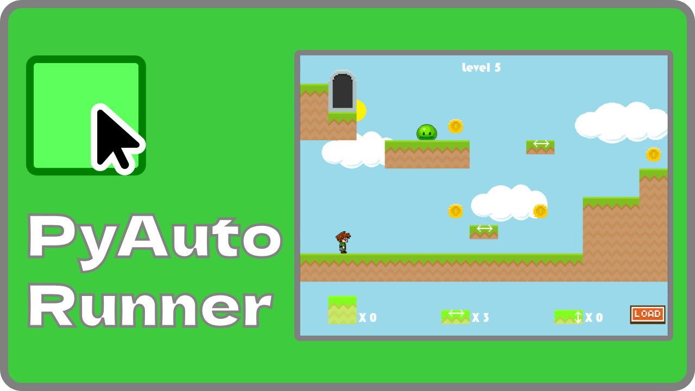
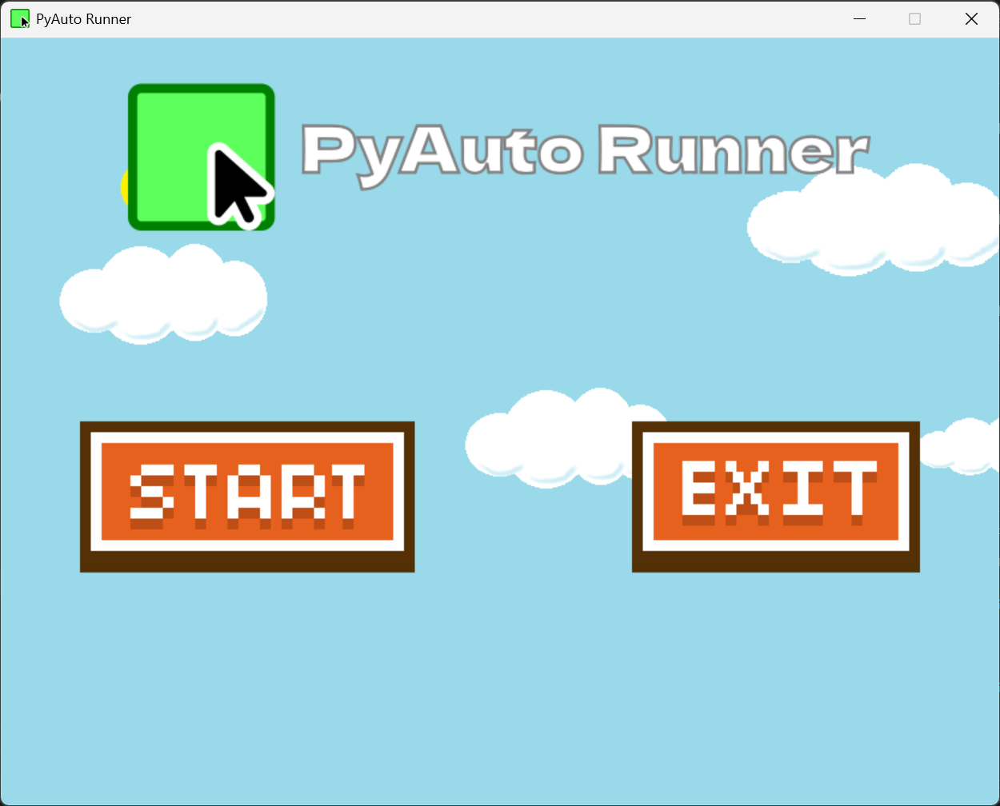
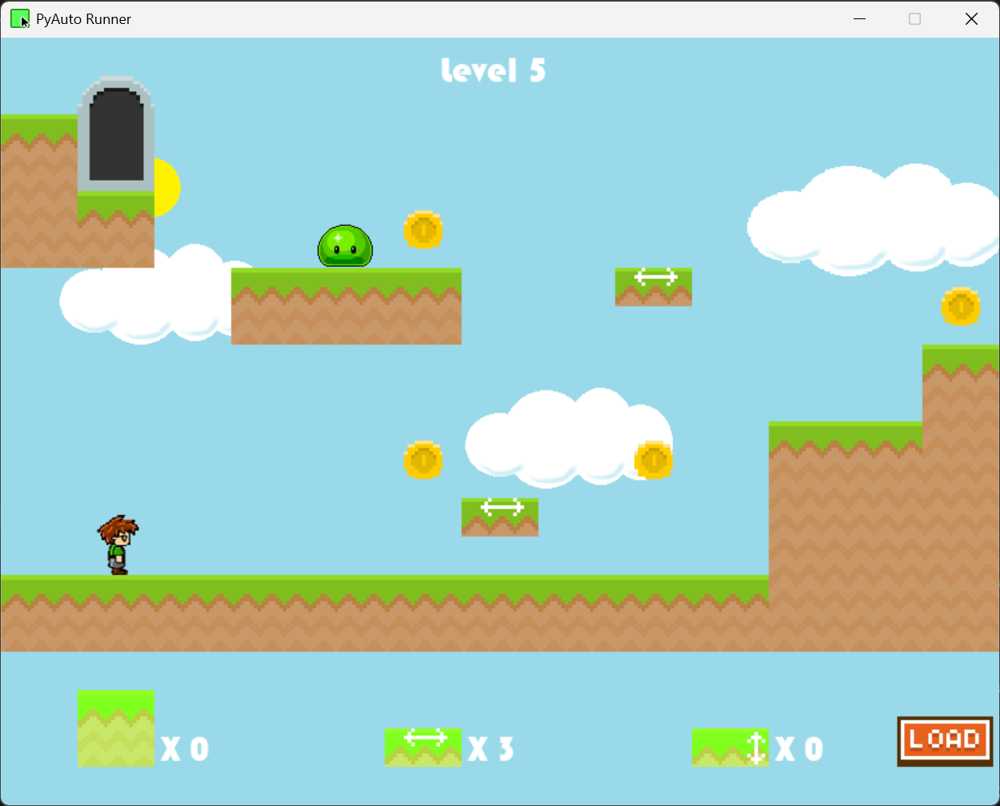
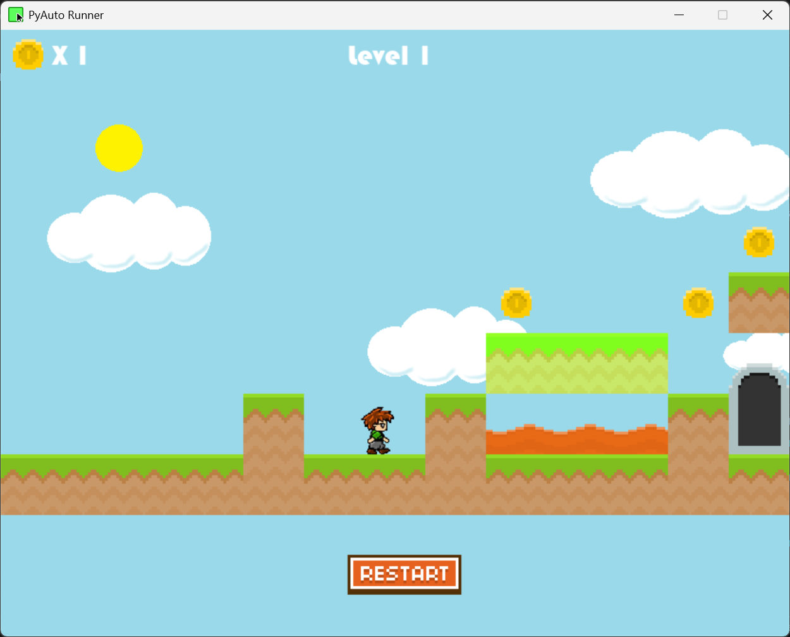

<figure>
    
</figure>

# PyAuto Runner

PyAuto Runner is an auto-runner game created by the PyAuto Team, consisting of Chisom A. (me), for the Spring 2026 C.O.D.E. Club Engineering Challenge at Prince George's Community College. In this game, you must place blocks to go through the levels. Also, the player moves automatically between left and right, meaning you can only jump manually. This game tests the player's strategy and coordination, as they must determine where to place the tiles and time their jump movements to complete each level.

## Demonstration

[Demonstration Video](https://youtu.be/P0hLLmMYhFM)

## How to Run the Game
### From Zip File (only Windows x86_64)
Download and extract the latest release. Run `pyauto-runner.exe` inside the newly created folder (the executable must be in the same folder that contains `_internal`).

### Manual Installation with Python
Install Python3 and download the repository. Install the dependencies with the command `pip install -r requirements.txt`. Run `main.py` to run the game.

## Instructions

For editing the levels:
* Left-click - Select the block you want to place and select an area in the level where you want to place it. Click again to remove the block you placed.

Restrictions:
* Can't place blocks on pre-existing blocks, coins, or the player
* Can't place blocks next to enemies

Player Controls:
* W, Up Arrow, Spacebar - Jump

## Project Experience

### Screenshots

<figure>
    
</figure>

<figure>
    
</figure>

<figure>
    
</figure>

### Inspiration
The idea of this project started after completing my entry for the previous C.O.D.E. Club challenge, PySquare Mover. While working on that project was fun, I felt it didn't push my capabilities in what I could develop in Python. My goals for this project were to push my limits in Python and make the game more advanced in every aspect compared to my previous entry in functionalities, artwork, audio, and presentation. For this project, I was inspired by two games: Super Mario Maker, a game where you can play and create user-made levels, and Super Mario Run, a game where you're constantly running through courses and must time your jumps to succeed. I wanted to combine these aspects into one game where you must place blocks at the right places and time your jumps to complete the levels.

### Development Challenges
The biggest challenge with this project was developing a platformer engine (including player controls and movement, loading objects from level data, coin counter, enemies, etc.) I realized I would have to find tutorials on creating one to make my game. Thankfully, I found tutorials from Coding with Russ's YouTube channel, which guided me on writing code for the engine's functionalities. I really enjoyed his tutorials as he explained each line of code in a way that was easy for me to understand.

After developing the engine, I had to create the game's levels. Thankfully, Coding with Russ had a level editor I modified and used to create my levels, saving me time from creating one from scratch. Still, it was quite challenging to create the game's levels due to my lack of experience in creating levels for platformers. I had to come up with ideas on what the levels would focus on, then do playtesting after creating them to ensure they work properly.

Another challenge I had was packaging the game into a zip file with the data and executable. I wanted to package the game so people unfamiliar with using Python can still run the game. I found the PyInstaller tool to put all the scripts and assets into a folder with the executable. I then developed a PowerShell script to use the tool and package the folder created into an executable.

### Reflection
I had a very fun experience working on this project. I learned more about using Python and the Pygame framework, including the usage of classes, sound effects, data creation, and data processing. More importantly, I learned you don't have to limit yourself to your own knowledge and can use other people's work to boost your own creations. I feel proud of how far I pushed myself on this project and of overcoming the challenges it brought.

## Credits
*  [Coding with Russ's PyGame - Platformer Tutorials](https://www.youtube.com/playlist?list=PLjcN1EyupaQnHM1I9SmiXfbT6aG4ezUvu) - Base platformer code and assets
*  [Kenny.nl](https://kenney.nl/assets/platformer-art-deluxe) - Orginial source of artwork
*  [Freesound.org](https://freesound.org/) - Orginial source of sound effects
